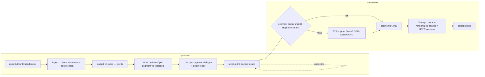

# Podcast Generator — Design Specification

Date: 2026-07-10
Status: Approved
Standards: [Python Development Standards v3](../../python_development_standards_v3.md)
Decisions: see [docs/adr/](../../adr/)

## Problem

A NotebookLM-style, local-first tool: feed it documents (txt/html/md/pdf/docx), get back
(1) a two-host podcast dialogue script in markdown and (2) an audio file rendered by a
**local** TTS model, hardware-accelerated on an AMD Ryzen AI Max+ 395 "Strix Halo"
(gfx1151, 128 GB unified memory) Linux machine.

## Technical ground truth (July 2026 research sweep)

- **Qwen3-TTS-12Hz-1.7B** (Apache-2.0) is the best-quality open per-utterance engine,
  verified working on Strix Halo GPU (~realtime, 8–10 GB) — but **single-speaker per
  call**, so podcasts require line-by-line synthesis + stitching.
- **Dialogue-native models** (VibeVoice, MOSS-TTSD) have license/provenance/speed
  caveats → phase-2 slot in the abstraction, not MVP.
- **gfx1151 PyTorch requires AMD "TheRock" nightly wheels**
  (`https://rocm.nightlies.amd.com/v2/gfx1151/`); stock ROCm wheels fail; do NOT set
  `HSA_OVERRIDE_GFX_VERSION=11.0.0`. Conv-heavy models run slower on this GPU than CPU
  → per-engine device routing is mandatory.
- **Local script LLM**: Qwen3-30B-A3B-Instruct-2507 via Ollama (~100 tok/s, 262K ctx).
- **Prior-art lessons** (SurfSense, podcastfy, open-notebooklm): word-budget outlining
  is the only length control that works; cache synthesized segments per line; ffmpeg
  concat demuxer; EBU R128 loudness normalization.

## Requirements

| Decision | Choice |
|---|---|
| Podcast language | English only |
| Sources per episode | Multiple documents |
| Script LLM | Adapter layer: Ollama (local), Ollama Cloud, OpenAI, Claude, GitHub Copilot + built-in deterministic fake provider (tests/offline e2e) — extensible registry |
| Interface | CLI — rich, colorful, responsive, interactive as needed (typer + rich) |
| Workflow | Two-stage, resumable: `generate` → editable `script.md` → `synthesize`; `create` chains both |
| TTS architecture | Hybrid abstraction: stitched single-speaker engines now (Qwen3-TTS GPU default, Kokoro CPU fallback), dialogue-native engine slot for phase 2 |
| Speakers | Default 2 (one male + one female voice), configurable |
| Stack | Python 3.13 + uv (3.14 blocked by torch/TTS deps; standards allow 3.13 for dependency constraints; no t-strings) |

## Data flow



The `script.md` ⇄ `transcript.json` round-trip is the contract joint between the two
stages: `generate` always emits a file that re-parses losslessly (property-tested), so
hand edits survive.

## Architecture

```
src/podcast/
├── cli/
│   ├── app.py                # typer entry: generate|synthesize|create|doctor|engines|voices|config
│   └── ui.py                 # rich console helpers, progress orchestration, stderr/stdout split
├── config.py                 # pydantic-settings; TOML: ~/.config/podcast/config.toml + ./podcast.toml + env (keys)
├── errors.py                 # PodcastError hierarchy (IngestError, ProviderError, ScriptError, TTSError, AudioError)
├── ingest/
│   ├── loader.py             # dispatch by suffix/mime → SourceDocument(markdown, meta, tokens)
│   ├── converters.py         # markitdown[pdf,docx] backbone; trafilatura for article HTML
│   └── tokens.py             # tiktoken o200k_base × 1.15 safety factor; context-fit check
├── llm/
│   ├── base.py               # ChatProvider protocol: complete(messages, schema|None, stream) → typed result
│   ├── openai_compat.py      # one transport, four providers: ollama, ollama-cloud, openai, copilot
│   ├── copilot_auth.py       # GitHub device-flow → Copilot token exchange helper
│   ├── anthropic.py          # Claude via anthropic SDK; structured output
│   ├── fake.py               # deterministic canned-transcript provider; powers offline e2e + tests
│   ├── registry.py           # provider name → factory; extension point
│   └── structured.py         # json_schema where supported + schema-in-prompt + fence-strip + pydantic validate/retry
├── script/
│   ├── models.py             # Transcript{title, hosts, turns[{speaker, text}]}
│   ├── budget.py             # minutes → words: 150 wpm × min × calibration (default 0.85, per-engine measured)
│   ├── pipeline.py           # outline → per-segment dialogue → length validation/repair (>15% off)
│   └── markdown.py           # Transcript ⇄ script.md round-trip; sidecar transcript.json
├── tts/
│   ├── base.py               # TTSEngine protocol: capabilities(dialogue_native, device), synthesize_line/synthesize_dialogue
│   ├── qwen3.py              # Qwen3-TTS-12Hz-1.7B; GPU (TheRock torch); lazy import
│   ├── kokoro.py             # Kokoro-82M via kokoro-onnx; CPU; no torch dep — works-everywhere fallback
│   ├── voices.py             # voice registry; gender defaults (1M+1F); speaker→voice mapping
│   └── cache.py              # segment cache keyed sha256(engine, voice, text) → wav
├── audio/
│   └── assemble.py           # ffmpeg concat demuxer, 200–1000 ms randomized inter-turn silence,
│                             #   EBU R128 loudnorm, MP3 export (WAV intermediate)
└── doctor.py                 # env smoke-test: ffmpeg, torch+gfx1151, engine deps, provider reachability
```

**Episode workspace** (output of `generate`, input of `synthesize`):
`episodes/<slug>/{sources.json, outline.json, script.md, transcript.json, segments/*.wav, episode.mp3}`

**Dependency policy:** core install is torch-free. Qwen3-TTS lives behind extra
`podcast[qwen3]` with torch routed to the TheRock gfx1151 index via uv per-package
index pinning. ffmpeg is a documented system dep checked by `doctor`.

## Implementation phases

1. Scaffolding + quality rails (pyproject, lock, pre-commit, CI, gate scripts, errors, config, CLI skeleton, doctor v0)
2. Ingestion
3. LLM provider layer
4. Script pipeline + `generate`
5. TTS + audio, CPU path (`synthesize`, `create`)
6. Qwen3-TTS on gfx1151 (code-complete; hardware verification on the Strix Halo box)
7. Polish: `engines`/`voices`/`config` commands, README, nightly jobs

Post-MVP (recorded, not in scope): MOSS-TTSD dialogue-native engine, chapter markers,
intro/outro music ducking, streaming synth-while-generating, mkdocs API site.

## Verification

- All standards v3 gates: ruff, mypy+pyright strict, pytest `fail_under = 100`,
  hypothesis, jsonschema contracts, pre-commit, `uv lock --check`, adversarial review
  loop with committed audit report.
- E2E offline: `podcast create sample.md --engine kokoro --provider fake` → real
  `episode.mp3`; hand-edit one line, `synthesize` re-renders exactly one segment.
- Hardware checklist (post-merge, on the Strix Halo box): `uv sync --extra qwen3` →
  `podcast doctor` → `pytest -m integration` RTF benchmark → 15-min episode within
  ±15 % of target duration.

## Key risks

- **gfx1151 stack churn** — pin exact TheRock nightly; `doctor` verifies; Kokoro CPU
  keeps the tool usable if the GPU stack breaks.
- **Copilot auth complexity** — isolated in `copilot_auth.py`; GitHub Models API (PAT)
  is the documented fallback.
- **Length calibration** — 0.85 factor is a starting guess; phase 6 measurement makes
  it per-engine config.
- **100 % coverage + no-Any vs ML code** — torch-touching code stays in thin,
  integration-tested adapters typed via Protocol shims; core logic is pure and fully
  covered.
